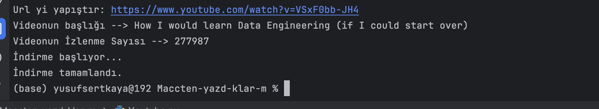

# Youtube video donwloader with python


[](https://travis-ci.org/joemccann/dillinger)

I bored of non-sense advertising
-
- ✨Magic ✨


For production environments...

```py
pip install pytube

```


#### Building for source

For production release:

```py
from pytube import YouTube
import os

try:
    link = input("Url yi yapıştır: ")

    youtube = YouTube(link)

    print("Videonun başlığı -->", youtube.title)
    print("Videonun İzlenme Sayısı -->", youtube.views)

    # En yüksek çözünürlüğü alıyorum
    stream = youtube.streams.get_highest_resolution()

    # İndirme dizinini ayarla
    download_path = r'/Users/yusufsertkaya/Desktop/youtubetan_inenler'

    # Dizinin mevcut olup olmadığını kontrol et, yoksa oluştur
    if not os.path.exists(download_path):
        os.makedirs(download_path)

    # İndiriyorum
    print("İndirme başlıyor...")
    stream.download(download_path)
    print("İndirme tamamlandı.")

except Exception as e:
    print("Bir hata oldu kusura bakma -->", str(e))
```



## License

MIT

**Free Software, Hell Yeah!**
